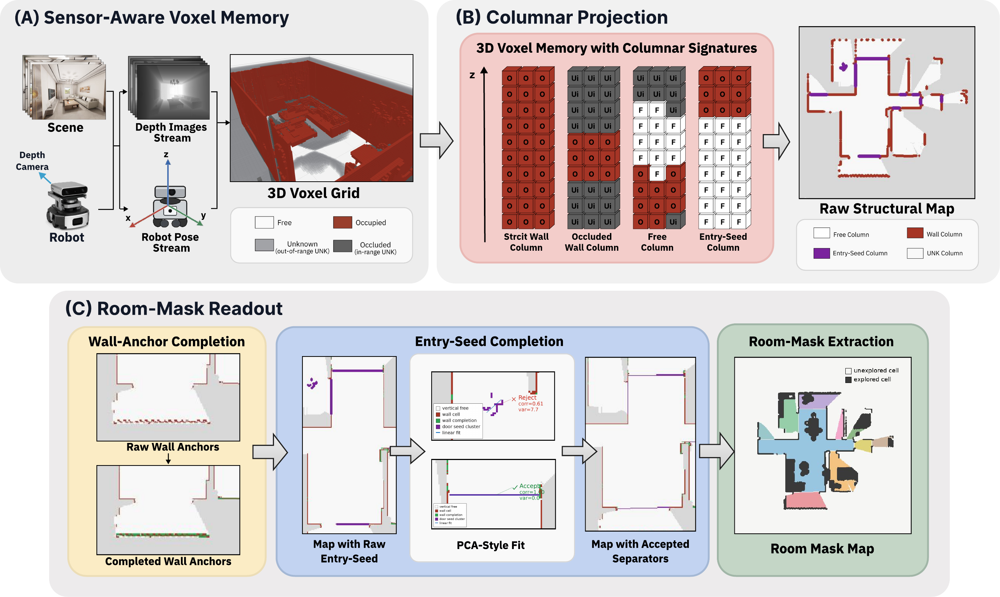

# VoxRoom

VoxRoom is an online room segmentation system for embodied RGB-D exploration in
Isaac Sim InteriorAgent scenes. It incrementally builds a 3D voxel map using
DDA ray integration, projects wall and free-space evidence into 2D maps,
detects door seeds from voxel geometry, completes reliable door lines, and uses
those door lines to partition the explored space into room masks.

This repository is organized as a paper-code release: the default path disables
semantic object detection, VLM/LLM scoring, and Habitat-specific components, and
focuses on the VoxRoom geometry pipeline in Isaac Sim.

## Pipeline

<p align="center">
  
</p>

## Requirements

The full online pipeline requires:

- Linux.
- NVIDIA GPU.
- Isaac Sim standalone 5.1.0.
- Python 3.11.
- InteriorAgent scene assets.
- Conda or Mamba.

The Python package also contains offline replay and evaluation utilities that
can be run without launching Isaac Sim if the saved snapshot `.npz` files are
already available.

## Installation

Create the Python environment:

```bash
cd /home/echo/VoxRoom
scripts/setup_voxroom_env.sh
source scripts/activate_voxroom_env.sh
```

If your environment name differs:

```bash
VOXROOM_ENV_NAME=voxroom scripts/setup_voxroom_env.sh
export VOXROOM_ENV_NAME=voxroom
source scripts/activate_voxroom_env.sh
```

Then install the local package in editable mode:

```bash
python -m pip install -e .
```

## Configure Paths

Edit `configs/voxroom_online.yaml`:

```yaml
paths:
  interioragent_root: /path/to/InteriorAgent
  isaac_sim_root: /path/to/isaac-sim-standalone-5.1.0-linux-x86_64

dataset:
  root: /path/to/InteriorAgent
```

The final VoxRoom geometry settings are already encoded in the default config:

```yaml
mapping:
  room_segmentation:
    voxel_grid:
      endpoint_splat_xy_radius_cells: 0
      endpoint_splat_z_radius_cells: 0
    voxel_navigation_projection:
      occupied_endpoint_xy_splat_radius_cells: 0
      occupied_endpoint_z_splat_radius_cells: 0
    voxel_step2:
      enabled: false
```

Do not re-enable `voxel_step2` for the paper pipeline; that stage is wall-line
extension and is not part of the final method.

## Prepare InteriorAgent Episodes

Generate 5 cm preprocessing outputs and one random-frontier episode per scene:

```bash
GENERATE_ONLY=1 scripts/run_all_scenes_random_frontier.sh
```

Expected outputs:

```text
data/interioragent_preprocessed_radius005/
data/interioragent_episodes/radius005_all_scenes/
```

## Run One Scene

Run `kujiale_0003` in Isaac Sim:

```bash
RUN_DIR=result/kujiale_0003_voxroom \
ROOMSEG_SNAPSHOT_MAX_SAVES=100000 \
VOXROOM_NUMBA_THREADS=28 \
VOXROOM_VOXEL_CPU_NUMBA_THREADS=28 \
scripts/run_one_scene_random_frontier.sh \
  data/interioragent_episodes/radius005_all_scenes/kujiale_0003.jsonl
```

The output directory contains:

```text
result/kujiale_0003_voxroom/
  results.jsonl
  roomseg_snapshots/
    roomseg_step_*.npz
```

Each snapshot stores the room-segmentation state at an online timestep,
including voxel-derived free/occupied/unknown maps, wall evidence, door seeds,
door completion layers, and room labels.

## Run All Scenes

```bash
RUN_ROOT=result/radius005_robot005_endpoint1x1_all_scenes \
PARALLEL_JOBS=4 \
RUN_NUMBA_NUM_THREADS=7 \
scripts/run_all_scenes_random_frontier.sh
```

For a serial debug run:

```bash
RUN_ROOT=result/debug_all_scenes \
PARALLEL_JOBS=1 \
RUN_NUMBA_NUM_THREADS=28 \
scripts/run_all_scenes_random_frontier.sh
```

## Render Door-Completion Snapshots

The final qualitative snapshot renderer produces two views per snapshot:

- raw door seed view,
- checked door-completion view after the final geometric filters and memory.

```bash
python scripts/render_final_door_completion_snapshots.py \
  --input-root result/radius005_robot005_endpoint1x1_all_scenes \
  --output-root result/door_completion_views \
  --stateful-by-scene
```

## Evaluate Room Segmentation

The CLI entry point is:

```bash
voxroom-roomseg-eval --help
```

The comparison scripts under `scripts/comparison/` prepare method roots,
ground-truth links, and per-method metric reports. A typical evaluation output
contains `summary_metrics.json`, `metrics_report.md`, and HTML/PNG room-mask
galleries.

## Reproduce the Final Snapshot Scheme

For the final replay-style door completion and room-mask evaluation:

```bash
scripts/run_final_door_completion_scheme_20260610.sh
```

This path mirrors the paper configuration used for the final door-completion
ablation: no-clearance navigation map input, 1x1 endpoint marking, no wall-line
extension, stateful door memory, and `0.95 * ceiling_height` door seed height.

## Development Checks

Run the lightweight semantic tests:

```bash
pytest -q tests/test_voxel_door_seed_semantics.py
```

Compile the edited runtime files:

```bash
python -m py_compile \
  voxroom_online/isaac_runtime/mapping/voxel_occupancy_grid.py \
  voxroom_online/isaac_runtime/mapping/online_mapper.py \
  voxroom_online/isaac_runtime/mapping/voxel_occupancy_door_wall_roomseg.py \
  voxroom_online/isaac_runtime/graph/room_context.py \
  voxroom_online/isaac_runtime/scripts/run_one_episode.py
```

## Notes on Baselines

External baselines are intentionally not vendored into this repository. Use
`external_baselines/README.md` and `scripts/comparison/00_fetch_and_build_external_baselines.sh`
to fetch or build baseline code when running formal comparisons.

## Citation

The paper citation will be added after release.
