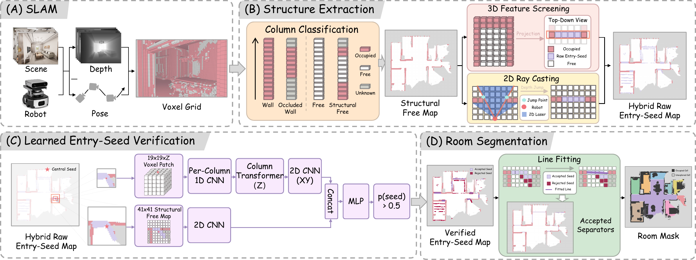
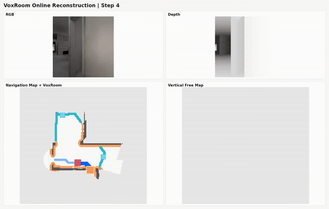

# VoxRoom

## Room Segmentation from Partial Observations during Robot Exploration

**Submitted to ICRA 2027 — Under Review.**
**Project maintainer and code contributor:** [EchO-NN](https://github.com/EchO-NN) · [2579947814@qq.com](mailto:2579947814@qq.com)

[Pipeline](#pipeline) · [Demos](#demonstrations) · [Installation](#installation) · [Reproduction](docs/reproduction.md) · [Results](#evaluation) · [Method details](docs/method.md)

VoxRoom incrementally segments rooms from the **partial 3D occupancy observations** available during robot exploration. Instead of waiting for a complete floor plan, it combines voxel-column height structure with a wider planar context to verify room-entry evidence and construct room separators. Unobserved space remains unassigned.

## Pipeline

[](docs/assets/pipeline.pdf)

[Download the original vector PDF](docs/assets/pipeline.pdf).

1. **Voxel mapping.** Integrate posed observations into a gravity-aligned occupancy grid with free, occupied, and unknown states.
2. **Structural extraction.** Aggregate free-space evidence along voxel columns into a **Structural Free Map (SFM)**. Combine candidates from 3D height-pattern screening and 2D ray-length discontinuities using a union, retaining candidates discovered by either source.
3. **Learned entry-seed verification.** Jointly encode a local **19 × 19 × Z voxel patch** and a **41 × 41 SFM context** to estimate an entry probability for each candidate.
4. **Room segmentation.** Cluster verified seeds, fit and geometrically validate line segments, maintain stable separators, and label connected structural-free regions. Project the resulting room labels onto the navigation-free map.

**Terminology:** the manuscript calls the representation *Structural Free Map*; the implementation retains the earlier names `Vertical Free Map`, `context_source: vertical`, and `voxel_vertical_free_xy`. It is not the collision map: furniture can interrupt traversability while free observations at other heights still support structural connectivity. Virtual room separators do not make doorways physically occupied.

## Demonstrations

### Simulation — Isaac Sim / InteriorAgent

[](docs/assets/voxroom_simulation_10x.mp4)

[Watch / download the full MP4](docs/assets/voxroom_simulation_10x.mp4) · [Browser demo page](docs/index.html)

The supplied recording shows `kujiale_0003`: RGB, depth, navigation-space room masks, and the Vertical Free Map during exploration. The MP4 is **10× playback**, 2200 × 1400 pixels, and approximately 14.2 seconds long. The GIF is a smaller preview of that same clip. This is a qualitative demonstration, not an additional held-out test episode or a wall-clock inference benchmark.

For a playable HTML page, open `docs/index.html` in a browser or run `python -m http.server 8000` and visit `http://localhost:8000/docs/`. GitHub's README shows the GIF and links to the MP4; it does not need an external video host.

### Real-world robot — Coming soon

**A dedicated real-world demonstration video and deployment code will be added here.** No real-world video or segmentation-quality benchmark is included yet. The [demo page](docs/index.html#real-world) reserves a separate section, and [`real_robot/`](real_robot/README.md) reserves the deployment-code entry point. The measurements below describe the separate robot-side implementation; they do not imply that its FAST-LIO2/TensorRT integration has already been released. See [the media guide](docs/assets/README.md) for the future recording.

### Real-world hardware and module latency

| Component | Platform |
| --- | --- |
| 3D LiDAR | PACECAT (蓝海光电) LDS_M200_E |
| RGB monitoring camera | DJI Osmo Action 4; used for viewpoint monitoring, not as the SLAM sensor |
| Mobile base | Circular, two-wheel differential-drive platform |
| Onboard computer | Intel Core Ultra 9 275HX + NVIDIA GeForce RTX 5070 Laptop GPU; computer carried on the base |

The following robot-side measurements were supplied by the project maintainer. **All durations are in milliseconds.** SLAM is a multi-frame real-robot average; the VoxRoom stages are module measurements on one archived map, not averages over the simulation test set.

| Stage | Included work | Time (ms) | Measurement / scheduling |
| --- | --- | ---: | --- |
| SLAM and voxel mapping | FAST-LIO2 and point-cloud-to-voxel-map processing, including publishing/finalization | 54.52 | Multi-frame real-robot average |
| Structural extraction | Voxel evidence, SFM / Vertical Free Map, rule-based 3D raw seeds, and constraints | 136.95 | Per archived-map stage evaluation |
| 2D ray casting | TVARS-style planar ray casting and historical candidate merging | 42.48 | **Per invocation; invoked once per second (1 Hz)** |
| FP16 neural verification | TensorRT FP16 inference, including input preparation and candidate filtering | 355.06 | Per archived-map stage evaluation; not per individual seed |
| Post-processing | Post-verification segmentation and room-property processing | 286.93 | Per archived-map stage evaluation |
| **VoxRoom total (excluding SLAM / mapping)** | **Structural extraction + 2D ray casting + FP16 neural verification + post-processing** | **821.42** | **Sum of the four VoxRoom stages, including one ray-casting invocation** |

**VoxRoom total:** `136.95 + 42.48 + 355.06 + 286.93 = 821.42 ms`, excluding the **54.52 ms** SLAM/mapping stage. The FP16 verification value is **355.06 ms**, as clarified by the project maintainer. OctoMap-to-dense-array conversion and external navigation-projection preparation were **not separately timed**. The module sum is not a synchronized end-to-end latency or system frame-rate measurement. [Measurement notes](real_robot/README.md#latency-measurement-notes)

## Entry-seed verifier

| Component | Representation / operation |
| --- | --- |
| Local input | `B × 4 × Z × 19 × 19`: unknown, free, occupied, and normalized absolute height |
| Per-column encoder | Shared 1D CNN, followed by two Transformer layers with four attention heads and width 40 |
| Column pooling | Mean + max over height → 80 features per column |
| Local spatial encoder | Reassemble `B × 80 × 19 × 19`; residual 2D CNN and spatial mean + max pooling → 224 features |
| Context input | `B × 3 × 41 × 41`: unknown, structural free, and occupied |
| Context encoder | Residual 2D CNN and spatial mean + max pooling → 224 features |
| Fusion | Concatenate → 448; MLP `448 → 160 → 40 → 1`; sigmoid |
| Decision | Keep candidates with `p ≥ 0.5` |

At 0.05 m resolution, the patches span 0.95 × 0.95 m and 2.05 × 2.05 m. `Z` must match the checkpoint and voxel height discretization; it is not an additional horizontal patch size.

The release also includes **inference-time voxel-column encoding reuse**: identical column inputs share their CNN/Transformer encoding, and cached descriptors are gathered back into each candidate's local XY patch. This does not retrain the network or cache final room decisions. Cache entries are bounded and invalidated when input or model conditions change; see [implementation details](docs/method.md#inference-time-column-reuse).

## Installation

The simulation workflow uses Linux, Python 3.11, NVIDIA Isaac Sim standalone **5.1.0**, and an NVIDIA GPU. Scene assets, Isaac Sim, the selected occupancy-mapping backend, and trained checkpoints are external dependencies, not bundled downloads.

```bash
git clone https://github.com/EchO-NN/VoxRoom.git
cd VoxRoom
bash scripts/setup_voxroom_env.sh
source scripts/activate_voxroom_env.sh
python -m pip install -e '.[door-seed-learning]'
```

Install a PyTorch/CUDA build compatible with your GPU and Isaac environment. The default mapping configuration uses the repository's `nvblox_fast_dda` integration path; installing this Python package alone does not install its external nvblox bindings. See [environment and data requirements](docs/reproduction.md).

Before running, copy `configs/voxroom_online.yaml` to an untracked local configuration and set the dataset, Isaac Sim, and checkpoint paths. The historical checkpoint path in the template is not a downloadable model.

```bash
cp configs/voxroom_online.yaml configs/voxroom.local.yaml
# Edit paths and mapping.room_segmentation.door_seed_learning.checkpoint_path.
export ISAAC_ROOT=/path/to/isaac-sim-standalone-5.1.0-linux-x86_64

CONFIG=configs/voxroom.local.yaml \
RUN_DIR=result/my_scene \
bash scripts/run_one_scene_random_frontier.sh /path/to/scene_episode.jsonl
```

This command runs a **random-frontier demonstration**. It is not, by itself, the paired baseline-evaluation protocol used for the reported table. Scene preprocessing, training, evaluation, checkpoint compatibility, and optional baseline setup are covered in [the reproduction guide](docs/reproduction.md).

## Training

The released tools support candidate collection, final-map annotation, label back-projection to historical snapshots, scene-level splitting, deduplication, and joint 2D/3D training. Apply the same spatial augmentation to both inputs; never split augmented copies of one scene across train/validation/test.

```bash
bash scripts/build_door_seed_dataset.sh \
  --collection-root /path/to/approved_collections \
  --split-file /path/to/scene_split.json \
  --out-dir data/door_seed_dataset

bash scripts/train_door_seed_classifier.sh \
  --index data/door_seed_dataset/dataset_vertical.jsonl \
  --out-dir outputs/door_seed_training \
  --context-source vertical \
  --checkpoint-selection-mode fixed_f1 \
  --threshold-selection-mode fixed --fixed-keep-threshold 0.5 \
  --train-rotation-degrees 0,90,180,270 --train-mirror-lr-once
```

These are training entry points, not a promise that a new run reproduces an existing checkpoint. The additional single left-right mirror is an explicit supported option. The main inference configuration retains line correlation **0.95**, orthogonal variance **0.65 cells²**, NN threshold **0.5**, and the experimental L-shaped dual-arm handling **disabled**.

## Evaluation

The following results are **reported in the supplied manuscript**, evaluated on InteriorAgent and GRScene under the shared-exploration protocol. Values are transcribed from the paper's tables, in percent, rather than recomputed from a different archived run. Training and model-selection scenes are excluded from the paper's test protocol.

### Comparison with other methods — Table I, Average

| Method | P ↑ | R ↑ | F1 ↑ | room-mIoU ↑ |
| --- | ---: | ---: | ---: | ---: |
| Gomez-reprod. | 92.8 | 87.7 | 89.6 | 64.4 |
| DUDE (Incremental) | 83.5 | 71.2 | 76.3 | 41.2 |
| DUDE (Snapshot) | 82.6 | 72.4 | 76.6 | 40.5 |
| ROSE² | 78.4 | 68.9 | 71.3 | 39.6 |
| Morphological | 77.9 | 97.4 | 85.8 | 40.2 |
| Distance Transform | 88.6 | 94.3 | 90.8 | 53.1 |
| Voronoi | 89.5 | 90.3 | 89.4 | 64.1 |
| TVARS | 85.6 | 97.4 | 90.6 | 50.8 |
| OccuSG | 89.8 | 67.4 | 76.4 | 51.3 |
| SysNav | 79.0 | 84.2 | 80.9 | 34.7 |
| **VoxRoom** | **93.7** | 94.2 | **93.6** | **77.3** |

### VoxRoom throughout exploration — Table I

| Coverage | P ↑ | R ↑ | F1 ↑ | room-mIoU ↑ |
| --- | ---: | ---: | ---: | ---: |
| 20% | 89.8 | 96.3 | 92.1 | 73.4 |
| 40% | 92.3 | 95.1 | 93.2 | 74.9 |
| 60% | 93.7 | 94.1 | 93.6 | 74.8 |
| 70% | 94.1 | 94.0 | 93.8 | 76.6 |
| 80% | 95.0 | 92.9 | 93.6 | 78.1 |
| 90% | 95.3 | 93.3 | 94.0 | 80.6 |
| Final | 96.0 | 93.9 | 94.7 | 82.6 |
| **Average** | **93.7** | **94.2** | **93.6** | **77.3** |

### Ablation study — Table III

| Setting | P ↑ | R ↑ | F1 ↑ | room-mIoU ↑ |
| --- | ---: | ---: | ---: | ---: |
| Full model | **93.8** | 94.2 | 93.6 | **77.4** |
| A1: without 2D ray-casting seeds | 91.0 | 96.0 | 92.9 | 68.4 |
| A2: without 3D voxel-derived seeds | 86.9 | 97.9 | 91.5 | 56.3 |
| A3: without learned verifier | 93.1 | 92.3 | 92.3 | 72.6 |
| A4: Nav-Free context instead of SFM context | 93.3 | 96.0 | **94.3** | 74.1 |
| A5: 2D-only verifier | 73.3 | **98.3** | 82.9 | 31.9 |
| A6: 3D-only verifier | 91.3 | 95.9 | 93.0 | 70.3 |
| A7: dense verification of all structural-free cells | 92.6 | 95.0 | 93.4 | 72.0 |

The full-model entries are preserved exactly as printed in each table: Table I reports 77.3 room-mIoU; Table III reports 77.4. A1/A2 change candidate sources; A4 changes only the verifier's 2D input; A7 removes candidate prescreening. These settings are not interchangeable.

<details>
<summary>Temporal stability — Table II</summary>

Compute statistics over each scene's available progress points first, then average scene-level statistics. Mean, CV, and Avg. Worst are percentages; SD is in percentage points.

| Method | F1 Mean ↑ | SD ↓ | CV ↓ | Avg. Worst ↑ | mIoU Mean ↑ | SD ↓ | CV ↓ | Avg. Worst ↑ |
| --- | ---: | ---: | ---: | ---: | ---: | ---: | ---: | ---: |
| Gomez-reprod. | 89.6 | 3.4 | 3.9 | 84.0 | 64.5 | 11.9 | 19.5 | 45.6 |
| DUDE (Incremental) | 76.4 | 5.4 | 7.0 | 68.8 | 41.3 | 11.7 | 27.5 | 25.9 |
| DUDE (Snapshot) | 76.7 | 5.5 | 7.1 | 69.2 | 40.6 | 12.2 | 29.2 | 24.8 |
| ROSE² | 71.3 | 17.8 | 27.7 | 39.1 | 39.7 | 16.1 | 44.1 | 16.9 |
| Morphological | 85.9 | 6.8 | 8.1 | 74.8 | 40.3 | 17.0 | 42.0 | 19.1 |
| Distance Transform | 90.8 | 4.6 | 5.2 | 82.5 | 53.2 | 15.3 | 29.8 | 31.1 |
| Voronoi | 89.4 | 4.1 | 4.6 | 83.0 | 64.1 | 13.4 | 22.0 | 43.2 |
| TVARS | 90.6 | 4.3 | 5.0 | 83.3 | 51.0 | 15.0 | 30.9 | 30.5 |
| OccuSG | 76.4 | 5.2 | 6.9 | 68.5 | 51.3 | **9.7** | 19.3 | 37.0 |
| SysNav | 80.9 | 7.0 | 9.0 | 69.1 | 34.7 | 14.9 | 42.6 | 17.0 |
| **VoxRoom** | **93.6** | **3.3** | **3.7** | **88.1** | **77.4** | 11.6 | **17.9** | **59.4** |

</details>

- Evaluate available checkpoints at **20%, 40%, 60%, 70%, 80%, 90%, and Final**. Missing checkpoints are reported, not fabricated.
- Compute metrics per checkpoint on the shared observed reference domain, then average across valid checkpoints; the two datasets are weighted by their checkpoint counts.
- P measures predicted-region purity; R measures coverage of each GT room by its best-overlapping prediction. F1 is computed per checkpoint before averaging.
- Room-mIoU uses maximum-total-IoU **one-to-one Hungarian matching**, divided by the number of GT rooms; unmatched GT rooms contribute zero.
- For temporal stability, first calculate mean, population SD, CV, and worst within each scene's available progress points, then average scene-level statistics.
- Filter room regions smaller than **0.5 m²**. Raw predictions and the evaluation domain determine metrics, not presentation colors or hand-edited figures.

The tables above follow manuscript Tables I–III. **Detailed experiment data and model weights are not uploaded in this release.** Existing local run exports are retained unchanged, not rewritten to match manuscript values; see [release notes](docs/release_notes.md).

## Repository guide

```text
voxroom_online/
  isaac_runtime/
    mapping/              # Occupancy, structural maps, doors, separators, room labels
    door_seed_learning/   # Collection, annotation, datasets, verifier, training, inference
    evaluation/           # Room-overlap metrics and evaluation workflows
    baselines/            # Adapters; external source/checkpoints are not bundled
    scripts/              # Simulation, dataset, training, and snapshot entry points
    visualization/        # Online diagnostic views
  real_runtime/           # Existing ZED runtime; not the unreleased LiDAR demo
configs/                  # Runtime configuration templates
scripts/                  # Launchers and reproducibility utilities
tests/                    # Regression tests
docs/
  assets/                 # Original pipeline PDF, PNG, simulation MP4/GIF/poster
  index.html              # Browser-playable demos, with a real-world placeholder
real_robot/               # Reserved FAST-LIO2 / voxel / TensorRT deployment release
repro/                    # Historical experiment manifests
```

## Citation, contact, and attribution

The associated manuscript is **VoxRoom: Room Segmentation from Partial Observations during Robot Exploration**, submitted to **ICRA 2027** and currently **under review**. A public paper link and finalized bibliographic metadata will be added when available.

For the software, use [CITATION.cff](CITATION.cff). Code maintenance and this release are credited to **EchO-NN**, [2579947814@qq.com](mailto:2579947814@qq.com). Contributions in this release use that Git author/committer identity, not the workstation's login name. Existing commit history and upstream authorship are retained.

The code is distributed under the [MIT License](LICENSE). Please retain the upstream copyright notices and consult [third-party attribution](docs/attribution.md). External datasets, models, simulator components, and baseline implementations retain their respective licenses.
